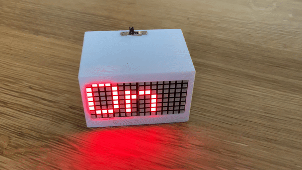

An IoT marquee effect LED display for ESP8266. This is especially handy when someone knocks on your door during video calls.

The software requires the [Adafruit_LEDMatrixArray](https://github.com/ebuehrle/Adafruit_LEDMatrixArray) library.

